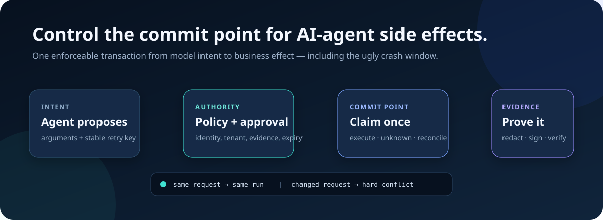

# AgentTrustOps

[](https://github.com/teresaliu90/AgentTrustOps/actions/workflows/ci.yml)
[](https://github.com/teresaliu90/AgentTrustOps/actions/workflows/codeql.yml)
[](https://www.python.org/)
[](LICENSE)
[](https://github.com/teresaliu90/AgentTrustOps/releases)
[](https://scorecard.dev/viewer/?uri=github.com/teresaliu90/AgentTrustOps)



**AgentTrustOps is the side-effect control plane for AI agents.** It governs the commit point where
a model-generated intention becomes a refund, deployment, message, account change, or other costly
mutation.

Frameworks orchestrate what an agent should do. Guardrails inspect content and traces. Policy
engines return decisions. Workflow engines make code durable. AgentTrustOps composes with all four
and owns a narrower transaction: **verified authority → policy → bound approval → one execution
claim → unknown-outcome reconciliation → portable audit evidence**.

## Prove the core contract in 60 seconds

No model, API key, Docker, or cloned repository is required:

```bash
pip install "agenttrustops @ https://github.com/teresaliu90/AgentTrustOps/releases/download/v0.3.0/agenttrustops-0.3.0-py3-none-any.whl"
agenttrust demo --output-dir demo-runs
```

The command persists a real SQLite ledger and prints a replayable result:

```text
States: pending_approval -> approved -> completed
Refund side effects: 1
Events: run.created -> policy.checked -> approval.requested -> ... -> run.completed
Replay: agenttrust replay <run-id> --ledger <path>/action-ledger.db
```

The proof is intentionally synthetic. It demonstrates the state, retry, approval, and audit
contracts without pretending to be a production adopter.

## Why this is a distinct product, not another agent framework

| Existing layer | Its primary job | The runtime gap AgentTrustOps closes |
|---|---|---|
| LangGraph / agent runtimes | Plan, route, interrupt, and resume agent work | A framework-independent commit contract for the business mutation |
| OPA / policy engines | Answer whether input is allowed | Durable lifecycle after the decision: approval, claim, execute, recover, reconcile |
| Temporal / durable workflows | Schedule and retry reliable application code | Agent-specific evidence, changed-request conflicts, privacy-safe side-effect evidence |
| Prompt/trace guardrails | Detect unsafe text, calls, or behavior | Transactionally block and record the effect instead of only observing it |

This is a complementary boundary, not a claim to replace those mature ecosystems. See the
[evidence-linked competitive analysis](docs/comparison.md).

## The contracts that matter after the demo

| Failure mode | Enforced behavior |
|---|---|
| A retry repeats a side effect | Same key + same governed request returns the stored run; changed actor, evidence, risk, metadata, or arguments is a hard conflict |
| A caller claims an admin identity | HTTP actor, tenant, and roles come only from a verified static-demo or OIDC/JWKS credential |
| A high-risk call bypasses review | Approval is bound to tenant, role, fingerprint, policy digest, expiry, and separation of duties |
| A worker dies around the provider commit | Leases and heartbeats move abandoned execution to `unknown`; AgentTrustOps never blindly retries it |
| An incident cannot be reconstructed | State and event append commit together; each run has a count/head-anchored SHA-256 event chain |
| An auditor cannot trust a database screenshot | Redacted evidence bundles can be Ed25519-signed and verified offline against a pinned public key |
| A safer release regresses | Deterministic adversarial scenarios block CI without a model or network |

## Make audit evidence portable

Install the audit extra, generate an offline signing identity, and export the ledger printed by the
demo:

```bash
pip install "agenttrustops[audit] @ https://github.com/teresaliu90/AgentTrustOps/releases/download/v0.3.0/agenttrustops-0.3.0-py3-none-any.whl"
agenttrust audit-keygen --private-key audit-private.pem --public-key audit-public.pem
agenttrust audit-export --ledger <ledger-from-demo> --signing-key audit-private.pem --output evidence.json
agenttrust audit-verify evidence.json --public-key audit-public.pem
```

The export refuses a failed source event chain and excludes raw arguments, evidence, results,
actors, approval notes, and idempotency keys. A pinned signature proves that the portable export was
not changed after signing. It does not turn an administrator-controlled source database into WORM
storage; the exact trust boundary is documented in [audit evidence](docs/audit-evidence.md).

## SDK: wrap the irreversible function

```python
from agenttrustops import ActionContext, SQLiteActionLedger, trusted_action

ledger = SQLiteActionLedger("actions.db")


@trusted_action(
    ledger=ledger,
    policy=refund_policy,
    risk="financial",
    idempotency_key=lambda args, ctx: f"refund:{ctx.tenant_id}:{args['order_id']}",
)
def execute_refund(order_id: str, amount: float):
    return payment_adapter.refund(order_id, amount)


result = execute_refund.invoke(
    context=ActionContext(
        actor_id="refund-agent",
        tenant_id="acme",
        roles=("refund_agent",),
        evidence=("ORDER:O-001", "LOGISTICS:O-001"),
    ),
    order_id="O-001",
    amount=800,
)
```

Direct calls to the wrapped function are blocked. Async actions use `invoke_async`. HTTP and tool
gateways use `invoke_request` to supply the caller's stable `Idempotency-Key` explicitly.
`ActionContext` is trusted SDK input; production gateways must derive it from authenticated identity
and systems of record, never model-visible arguments.

## Production-shaped control plane

Use SQLite for evaluation or one service instance. Use PostgreSQL for multi-process claims and
per-run event-chain locks. The FastAPI application provides authenticated invoke, approval, reject,
resume, reconciliation, audit, recovery, readiness, metrics, and a browser operations console.

The included Compose stack is a local demo:

```bash
docker compose up --build
```

For an OIDC-backed reference server, install `agenttrustops[api,postgres,oidc]`, set
`AGENTTRUSTOPS_POSTGRES_DSN`, and run:

```bash
agenttrust serve \
  --refunds refunds.db \
  --oidc-issuer https://identity.example \
  --oidc-audience agenttrustops-api \
  --oidc-jwks-url https://identity.example/.well-known/jwks.json
```

Issuer, audience, expiry, asymmetric algorithm, subject, tenant, and roles are verified. Static
identity files remain explicitly demo-only. TLS, secret management, authoritative evidence lookup,
provider-native idempotency, retention, and HA remain deployment responsibilities; read the
[production boundaries](docs/production-boundaries.md) before integrating a real mutation.

## Integrate without moving authority into the prompt

Tested adapters are included for LangGraph, OpenAI Agents SDK, FastMCP, and the OPA Data API. In
every adapter the model sees only business arguments; verified identity, evidence, and retry keys
come from trusted application context.

```python
refund_tool = as_openai_agents_tool(
    execute_refund,
    params_json_schema=refund_schema,
    context=context_from_authenticated_session,
    idempotency_key=request_id_from_application,
)
```

See [framework integrations](docs/integrations.md) for the executable contracts and dependency
extras.

## Release and supply-chain evidence

```yaml
- uses: teresaliu90/AgentTrustOps@v0.3.0
  with:
    scenarios: scenarios/refund.json
    policy: policies/refund.json
```

Versioned releases attach wheel/sdist artifacts, SHA-256 checksums, a CycloneDX SBOM, and GitHub
artifact attestations. CI exercises Python 3.11–3.13, a real PostgreSQL service, a pinned real OPA
server, OpenAI Agents/FastMCP contracts, package install, container smoke, dependency audit,
CodeQL, the reusable action, and deliberately unsafe release behavior. GHCR images publish with
SBOM/provenance; PyPI is not claimed live until its public package page exists.

## What is deliberately not claimed

- distributed exactly-once execution or rollback of irreversible effects;
- cryptographic immutability of the mutable source database;
- identity verification merely because a Python dataclass was constructed;
- a hosted managed service, regional HA result, compliance certification, or independent audit;
- production adoption inferred from stars, downloads, CI, maintainer demos, or synthetic load.

Those limits are product requirements, not footnotes. See [non-goals](docs/non-goals.md), the
[threat model](docs/threat-model.md), and the [operations runbook](docs/operations.md).

## Adoption is measured, not decorated

The current adopter registry remains honest. The [adoption ladder](docs/adoption-playbook.md)
defines what raises the external-adoption score from 1 to 10, and the
[unassisted design-partner challenge](docs/design-partner-feedback-kit.md) makes the first external
proof reproducible. Join the public
[v0.3 20-minute challenge](https://github.com/teresaliu90/AgentTrustOps/discussions/3). If you
evaluate a real workflow, submit the
[adopter report](https://github.com/teresaliu90/AgentTrustOps/issues/new?template=design-partner.yml)
at the visibility level you control.

## Documentation

- [Architecture and state machine](docs/architecture.md)
- [HTTP API walkthrough](docs/api.md)
- [Audit evidence and offline verification](docs/audit-evidence.md)
- [Operations and incident runbook](docs/operations.md)
- [Security model](docs/threat-model.md) and [production boundaries](docs/production-boundaries.md)
- [Framework integrations](docs/integrations.md)
- [Competitive comparison](docs/comparison.md) and [evidence-based scorecard](docs/scorecard.md)
- [Publishing](docs/publishing.md), [roadmap](ROADMAP.md), and [changelog](CHANGELOG.md)
- [Adopters](ADOPTERS.md), [governance](GOVERNANCE.md), [support](SUPPORT.md), and [contributing](CONTRIBUTING.md)

AgentTrustOps v0.3 is a beta-quality open-source control plane, not a compliance-certified managed
service. Apache-2.0 licensed. Contributions, real design-partner reports, adversarial scenarios,
and critical review are welcome.
